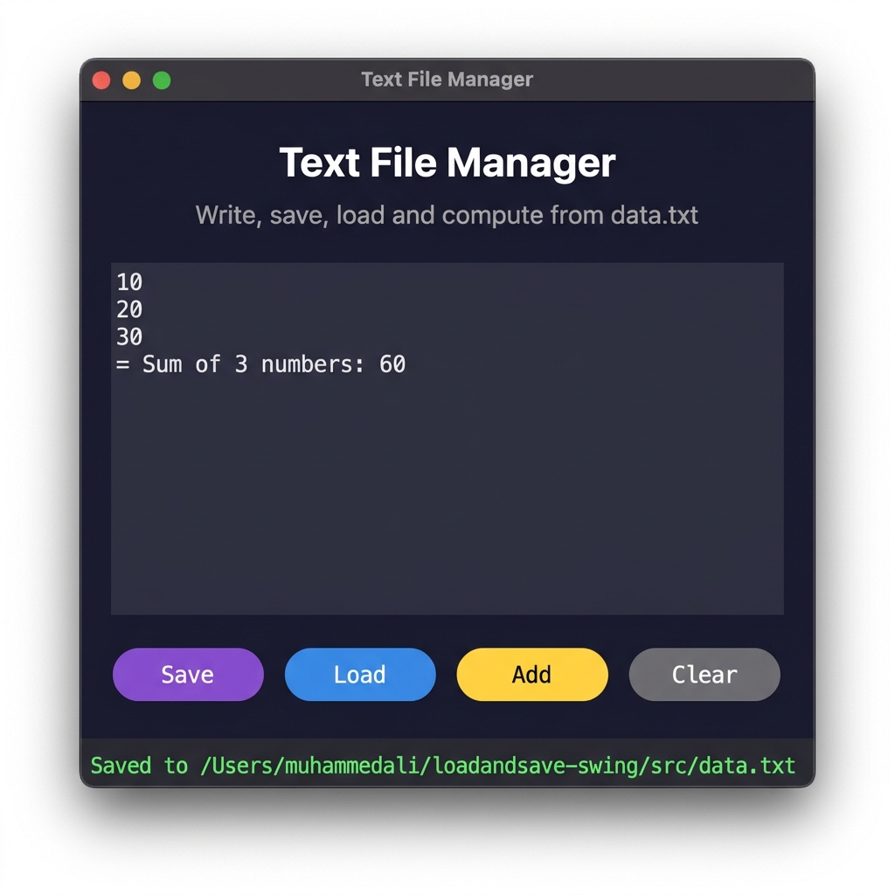

# Text File Manager

A Java Swing desktop application for writing, saving, loading, and computing with text files. Originally written as a basic college exercise to practice Java GUI programming and file I/O, this project has been modernized with a clean dark-themed interface and improved functionality.

---

## Tools Used

| Tool / Technology | Version | Purpose |
|---|---|---|
| Java (JDK) | 11 or higher | Core language and Swing GUI framework |
| Java Swing | Built-in (javax.swing) | Desktop GUI components |
| Java AWT | Built-in (java.awt) | Layout managers and graphics rendering |
| Java NIO | Built-in (java.nio.file) | Modern file reading |
| javac | Bundled with JDK | Java compiler |

> No external libraries or build tools (Maven/Gradle) are required. Everything runs on a plain JDK installation.

---

## Installation Steps

### Prerequisites

Ensure you have Java Development Kit (JDK) 11 or later installed.

**Check your Java version:**
```bash
java -version
javac -version
```

If Java is not installed, download it from [https://adoptium.net](https://adoptium.net) or use your package manager:

```bash
# macOS (via Homebrew)
brew install openjdk

# Ubuntu / Debian
sudo apt install default-jdk
```

### Clone the Repository

```bash
git clone https://github.com/mmali7921/loadandsave-swing.git
cd loadandsave-swing
```

---

## Execution Procedure

### Step 1 — Compile

Navigate into the `src` directory and compile the source file:

```bash
cd src
javac Main.java
```

This produces a `Main.class` file in the same directory.

### Step 2 — Run

```bash
java Main
```

The application window will open immediately.

> **Note:** `data.txt` is saved in the same directory as the `Main.class` file (i.e., inside `src/`). This is resolved automatically regardless of which directory you run the command from.

---

## Features

| Button | Action |
|---|---|
| **Save** | Writes the full contents of the text area to `data.txt`, overwriting any previous data |
| **Load** | Reads `data.txt` and fills the text area with all its contents |
| **Add** | Parses all integers in the text area (comma or newline separated) and appends the sum as `= Sum of N numbers: X` |
| **Clear** | Clears the text area instantly |

The status bar at the bottom provides real-time feedback — green for success, red for errors, yellow for warnings.

---

## Output Screenshots

### Application Window



> The screenshot above shows the application after entering three numbers (10, 20, 30), clicking **Add** to compute the sum (60), and then clicking **Save** to persist the result to `data.txt`.

---

## Project Structure

```
loadandsave-swing/
├── src/
│   ├── Main.java          # Full application source (single-file Swing app)
│   ├── Main.class         # Compiled bytecode (generated after javac)
│   └── data.txt           # Saved data file (generated at runtime)
├── docs/
│   └── screenshot.png     # Application screenshot
└── README.md
```

---

## Conclusion

This project started as a minimal college-level exercise to understand Java's `BufferedReader`, `BufferedWriter`, and basic Swing components. It demonstrated fundamental concepts such as:

- **GUI event handling** using `ActionListener` and lambda expressions
- **File persistence** with `FileWriter` and `FileReader`
- **Layout management** using `BorderLayout`, `GridLayout`, and `FlowLayout`

The modernized version introduces a dark theme (Catppuccin Mocha palette), custom-painted rounded buttons, a multi-line scrollable text editor, a real-time status bar, and improved file path resolution — transforming a basic exercise into a clean, functional desktop utility.

---

*Built with Java Swing | No external dependencies*
